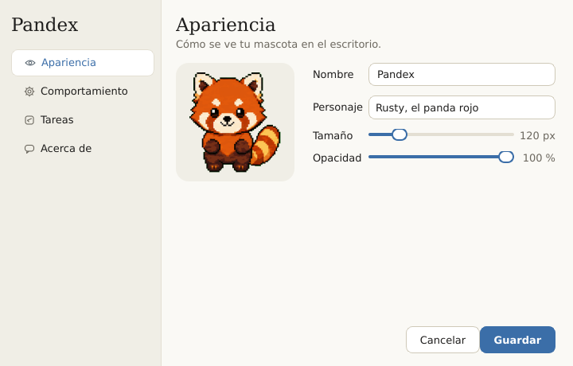
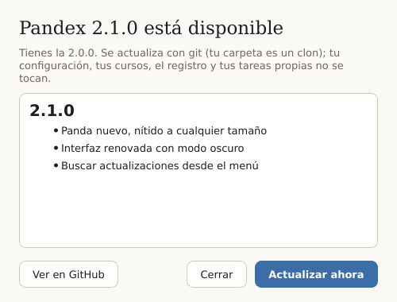

<p align="center">
  
</p>

<h1 align="center">Pandex</h1>

<p align="center">
  <b>Rusty, un panda rojo que vive en tu escritorio</b>, baja el material de tus cursos de
  <b>Canvas</b>, lo ordena en carpetas y convierte tus PDFs y diapositivas a <b>Markdown</b>.<br>
  Todo en tu computadora, gratis y sin IA.
</p>

<p align="center">
  <a href="https://github.com/frankrubio/pandex/actions/workflows/pruebas.yml"></a>
  
  
  
</p>

<p align="center">
  <picture>
    <source media="(prefers-color-scheme: dark)" srcset="docs/img/mascota-oscuro.png">
    
  </picture>
</p>

---

## Qué hace

| | |
|---|---|
| **Sincronizar Canvas** | Revisa cómo están organizados tus cursos en Canvas (semanas, secciones, teoría y laboratorio), arma una carpeta igual en tu PC y baja solo lo nuevo. En ~6 segundos cuando no hay novedades. |
| **Convertir a Markdown** | Pasa PDF, Word, PowerPoint, Excel y más a `.md` para estudiar, buscar o dárselos a tus herramientas. Distingue el material de estudio de las tareas y evaluaciones. Usa el OCR de Windows con los PDFs escaneados. |
| **Tus propias tareas** | Cada función es un archivo `.py` en `tasks/`. Lo dejas ahí y aparece en el menú. Puedes programarlas con un horario. |

Pandex es una ventanita transparente que flota sobre tus programas: haces **clic** para
saludar a Rusty, **clic derecho** para el menú, y te avisa con un globo cuando termina algo.
Es **liviano**: Rusty es una imagen fija por estado, así que en reposo no usa CPU (0 %) ni
repinta nada, y ocupa ~70 MB. Las librerías pesadas (navegador, conversor) se cargan solo
al usarlas, y la conversión a Markdown corre en un proceso aparte que, al terminar, le
devuelve su memoria a Windows.

<p align="center">
  <picture>
    <source media="(prefers-color-scheme: dark)" srcset="docs/img/menu-oscuro.png">
    
  </picture>
  &nbsp;&nbsp;
  <picture>
    <source media="(prefers-color-scheme: dark)" srcset="docs/img/configuracion-oscuro.png">
    
  </picture>
</p>

---

## Instalación

**Necesitas:** Windows 10 u 11, [Python 3.12 o más nuevo](https://www.python.org/downloads/)
(marca *"Add python.exe to PATH"* al instalarlo) y, de preferencia, Google Chrome.

1. Descarga el proyecto: botón verde **Code → Download ZIP** (y descomprímelo), o
   ```bash
   git clone https://github.com/frankrubio/pandex.git
   ```
2. Haz doble clic en **`instalar.bat`**. Crea un entorno de Python propio (no toca el de tu PC),
   instala lo necesario y deja un acceso directo **Pandex** en tu Escritorio.
3. Abre **Pandex** desde el Escritorio.

**¿Perdiste el acceso directo?** En Pandex: **Configuración → Comportamiento → Crear en el
Escritorio**. O haz doble clic en **`Pandex.pyw`** (en la carpeta del proyecto); para tenerlo
a mano: clic derecho → *Enviar a → Escritorio (crear acceso directo)*. Si Pandex ya está
abierto, la mascota solo se asoma.

> **Windows 11 con «Control de aplicaciones inteligente»:** si descargaste el ZIP con el
> navegador y Windows bloquea algún archivo, quítales la marca de «descargado de internet»
> con PowerShell: `Get-ChildItem -Path "C:\ruta\a\pandex" -Recurse | Unblock-File`.
> No desactives ese control: Windows no deja volver a activarlo.

<details>
<summary>Instalación manual (si prefieres la terminal)</summary>

```bash
py -3 -m venv .venv
.venv\Scripts\python.exe -m pip install -r requirements.txt
.venv\Scripts\python.exe -m playwright install chromium   # solo si no tienes Google Chrome
.venv\Scripts\python.exe -m pandex.accesos                # acceso directo en el Escritorio
.venv\Scripts\pythonw.exe main.py                         # abrir Pandex
```
</details>

---

## Actualizar Pandex

**Clic derecho → Buscar actualizaciones…** (o **Configuración → Acerca de**). Pandex consulta
GitHub solo cuando se lo pides, te muestra qué trae la versión nueva y, si aceptas:

- si lo instalaste con `git clone`, hace `git pull`;
- si bajaste el ZIP, descarga la versión nueva y copia encima, guardando antes una copia de
  lo que reemplaza en `%LOCALAPPDATA%\Pandex\respaldos`.

Tu `config.json` (tus cursos y ajustes), el registro, el entorno `.venv` y las tareas que
agregaste en `tasks/` **no se tocan**. Si hacen falta dependencias nuevas, las instala. Al
final, un botón reinicia Pandex.

<details>
<summary>¿Tienes la versión 2.0.0? (todavía no trae este botón)</summary>

Actualiza una sola vez a mano; desde la 2.1 ya es un clic:

- **Con git:** en la carpeta de Pandex, `git pull`.
- **Con ZIP:** descarga el ZIP nuevo y descomprímelo **encima** de tu carpeta de Pandex
  (acepta reemplazar). Tu `config.json` no viene en el ZIP, así que se queda como está.

Luego abre Pandex: Rusty reemplaza al panda anterior (si habías puesto un personaje propio,
se respeta) y puedes volver al de antes en **Configuración → Apariencia → Personaje**.
</details>

<p align="center">
  <picture>
    <source media="(prefers-color-scheme: dark)" srcset="docs/img/actualizar-oscuro.png">
    
  </picture>
</p>

---

## La primera vez: el asistente

La **primera vez** que abres Pandex (o mientras Canvas no esté configurado) se abre un
asistente que te guía. No vuelve a aparecer solo: si quieres cambiar algo después, usa
**clic derecho → Configurar Canvas…**.

1. **Tu Canvas.** Escribe la dirección de tu universidad (`https://tu-universidad.instructure.com`).
2. **Inicia sesión.** Se abre el navegador; entras con tu cuenta institucional, como siempre,
   y la ventana se cierra sola. **Pandex nunca ve ni guarda tu contraseña.**
3. **Tus cursos.** Pandex lee cómo está organizado cada curso y te propone cuáles sincronizar.
   Si un curso tiene **teoría y laboratorio** como dos cursos de Canvas, los junta en una
   carpeta con `Teoría` y `Lab` dentro de cada semana. Puedes renombrar cada carpeta.
4. **Dónde guardarlos:**
   - **Una carpeta nueva** (sugerencia: dentro de tu OneDrive, para tenerla respaldada), o
   - **una carpeta donde ya tenías tus cursos.** Pandex reconoce qué carpeta es de qué curso,
     aprende cómo nombras las cosas (`Sem 3` o `Semana 03`, `Lab` o `Laboratorio`…) y te ofrece
     **ordenar** los archivos de Canvas que estén fuera de lugar. Antes te muestra la lista
     completa, nunca borra ni reemplaza nada, no toca lo que no viene de Canvas (tus trabajos,
     tus notas) y puedes **deshacerlo**.
5. **Descarga inicial:** todo lo publicado hasta hoy · solo **desde la semana N** · o **nada**
   (solo lo que se publique de ahora en adelante).
6. *(Opcional)* Que revise Canvas solo, **todos los días a una hora**.

Nada se escribe en tu disco hasta que pulsas **Terminar**. Entonces empieza la primera sincronización.

---

## Uso diario

- **Clic derecho → Sincronizar Canvas.** Al terminar te dice qué hizo en una línea
  (`✓ 3 nuevo(s): Cálculo 2, Física 1 · 8 s`) y, si hubo novedades, abre un resumen con
  cada archivo y la carpeta donde quedó.
- **Clic derecho → Convertir a Markdown.** Eliges una carpeta o archivos con el teclado y
  Pandex los convierte en segundo plano. → [Cómo funciona](docs/convertir-markdown.md)
- **Configuración:** personaje, nombre, tamaño y opacidad de la mascota, el globo, arrancar
  con Windows y el horario de cada tarea. Sigue el modo claro u oscuro de Windows.
- **Ver registro:** qué hizo Pandex y por qué (útil si algo falla). Se puede filtrar y
  resalta avisos y errores.
- Si la ocultas, vuelve con el ícono del panda junto al reloj de Windows.

### Cómo quedan tus carpetas

```
Mis cursos/
├── Programación I/
│   ├── Sem 1/
│   │   ├── Teoría/
│   │   │   └── Material de clase/      ← el subencabezado del módulo en Canvas
│   │   │       └── Clase 1.pdf
│   │   └── Lab/
│   │       └── Lab 1 - Introducción.pptx
│   └── Sílabo y anexo/                 ← módulos que no son de una semana
└── Cálculo/
    └── Sem 1/
        └── Actividades/
            └── Guía 1.pdf
```

Reglas que Pandex nunca rompe al sincronizar: **solo crea archivos nuevos** (no borra, mueve,
sobrescribe ni renombra nada tuyo), no baja dos veces lo que ya tienes (aunque lo hayas
renombrado o movido) y un archivo a medio bajar nunca llega a tu carpeta.
→ [Todos los detalles](docs/sincronizar-canvas.md)

---

## Privacidad

- **Tu contraseña no la ve nadie.** Inicias sesión en una ventana del navegador; Pandex solo
  reutiliza esa sesión, guardada en un perfil propio en `%LOCALAPPDATA%\Pandex`.
- **Nada sale de tu PC** salvo las consultas a tu propio Canvas y, solo cuando lo pides,
  la consulta a GitHub para buscar actualizaciones. No hay servidores, ni telemetría, ni IA
  en la nube: el conversor y el OCR son locales.
- **Tus datos no van al repositorio.** `config.json` (tus rutas y cursos) y `logs/` están en
  `.gitignore`; el historial y la sesión viven fuera de la carpeta del proyecto.
- Pandex solo ve lo que Canvas le muestra a un alumno: lo que el docente aún no publicó, no.

---

## Para programadores

```
pandex/                 el paquete
├── app.py              une mascota, menú, bandeja, ejecutor y reloj
├── tareas.py           el contrato de los plug-ins: descubrir tareas y su contexto (ctx)
├── ejecutor.py         corre una tarea en un hilo aparte (la interfaz nunca se congela)
├── programador.py      horarios cron (APScheduler)
├── actualizar.py       «Buscar actualizaciones…»: git pull o ZIP de GitHub, con respaldo
├── config.py · rutas.py · log.py · accesos.py
├── ui/                 Rusty, el globo, el tema claro/oscuro y los diálogos (PyQt6)
├── canvas/             todo Sincronizar Canvas: cliente, sesión, estructura, destinos,
│                       historial, sincronizar, adoptar (reordenar) y el asistente
└── markdown/           todo Convertir a Markdown: clasificador, archivos, motor, lote, navegador
tasks/                  los plug-ins: un .py por función (delgados; la lógica está en pandex/)
tests/                  pruebas sin internet: Canvas falso, carpetas temporales, ventanas invisibles
herramientas/           crear el ícono, las capturas del README y preparar un sprite nuevo
docs/                   documentación detallada
```

- **Arquitectura y flujo completo:** [docs/arquitectura.md](docs/arquitectura.md)
- **Crear tu propia tarea** (con ejemplos): [docs/crear-tareas.md](docs/crear-tareas.md)
- **Sincronizar Canvas por dentro:** [docs/sincronizar-canvas.md](docs/sincronizar-canvas.md)
- **Convertir a Markdown por dentro:** [docs/convertir-markdown.md](docs/convertir-markdown.md)

Una tarea mínima, `tasks/hola.py`:

```python
class Task:
    id = "hola"
    nombre = "Decir hola"

    def run(self, ctx):
        ctx.decir("¡Hola!")
        return {"ok": True, "resumen": "Saludé."}
```

**Pruebas** (sin internet; no tocan tus datos):

```bash
.venv\Scripts\python.exe -m unittest discover -s tests -t .
```

**Probar que abre** (se cierra sola a los 3 segundos):

```bash
.venv\Scripts\python.exe main.py --test
```

---

## Cambiar el personaje

En **Configuración → Apariencia → Personaje** eliges entre **Rusty** (el panda rojo), el
**panda robot** vectorial o el **panda robot en pixel art**. Para usar tu propia imagen:

```bash
.venv\Scripts\python.exe herramientas/preparar_sprite.py mi_imagen.png assets/mi_mascota/spritesheet.png
```

Le quita el fondo liso, la recorta y la guarda con transparencia. Si tu mascota es un
**GIF** (por ejemplo, de [Codex Pets](https://codex-pets.net)), conviértelo en un sprite
sheet con `herramientas/gif_a_sprite.py mascota.gif assets/mi_mascota/spritesheet.png`
(cuadros de 192×208, uno al lado del otro). Luego, en `config.json`,
pon `"personaje": "pixel"` y apunta `spritesheet → archivo`, `frame_ancho` y `frame_alto` a
ella. Con un sheet de varias poses, cada estado (`idle`, `feliz`, `trabajando`, `error`)
lista su cuadro como `[fila, columna]`.

Para regenerar el ícono o las capturas del README:
`herramientas/crear_icono.py` y `herramientas/capturas.py`.

---

## Si algo falla

| Qué ves | Qué hacer |
|---|---|
| *"No encontré un navegador"* | Instala Google Chrome o ejecuta `.venv\Scripts\python.exe -m playwright install chromium`. |
| Se abre el navegador cada vez | Tu universidad pide iniciar sesión seguido. Entra y la ventana se cierra sola. |
| *"No reconocí ninguno de tus cursos"* | Empezó otro ciclo: **clic derecho → Configurar Canvas…** |
| Una carpeta `Lab` (o una semana) queda vacía | Mira el curso en Canvas: Pandex solo ve los módulos **publicados**. |
| Bajó algo dos veces o no bajó algo | **Ver registro**: cada decisión dice por qué (`ya lo tenías (mismo nombre) → ruta`). |
| No me gustó cómo ordenó mi carpeta | **Configurar Canvas… → Deshacer el último reordenamiento.** |
| Quiero empezar de cero | Borra `config.json` (y si quieres, `%LOCALAPPDATA%\Pandex`) y abre Pandex. |

---

## Créditos

Hecho por Frank, estudiante de UTEC, junto con Claude. **Rusty** es obra de
[LuoSKraD](https://codex-pets.net/users/luoskrad), publicado en
[Codex Pets](https://codex-pets.net/share/rusty); el personaje y el ícono se describen en [assets/CREDITS.md](assets/CREDITS.md). Los cambios de cada versión están en
[CHANGELOG.md](CHANGELOG.md). Usa
[PyQt6](https://www.riverbankcomputing.com/software/pyqt/),
[Playwright](https://playwright.dev/python/),
[MarkItDown](https://github.com/microsoft/markitdown) y
[APScheduler](https://apscheduler.readthedocs.io/).

Licencia [MIT](LICENSE): úsalo, cámbialo y compártelo.
