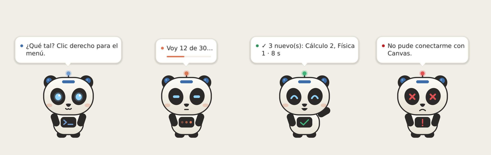
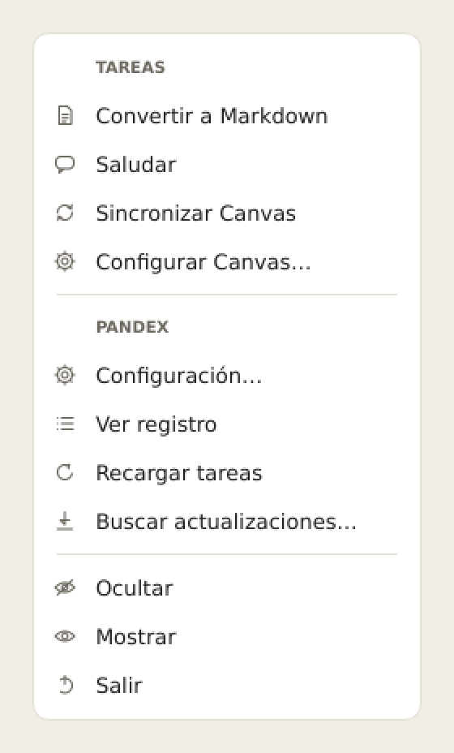

<p align="center">
  
</p>

<h1 align="center">Pandex</h1>

<p align="center">
  <b>Rusty, un panda rojo en tu escritorio</b>, baja el material de tus cursos de <b>Canvas</b>,
  lo ordena por semanas y convierte tus PDFs y diapositivas a <b>Markdown</b>.<br>
  Gratis, en tu PC y sin IA.
</p>

<p align="center">
  <a href="https://github.com/frankrubio/pandex/actions/workflows/pruebas.yml"></a>
  
  
  
</p>

<p align="center">
  <picture>
    <source media="(prefers-color-scheme: dark)" srcset="docs/img/mascota-oscuro.png">
    
  </picture>
</p>

## Instalar (5 minutos)

Necesitas **Windows 10 u 11** y **Python**.

1. **Instala Python** desde [python.org/downloads](https://www.python.org/downloads/).
   En la primera pantalla del instalador marca **☑ Add python.exe to PATH**.
2. **Descarga Pandex:** arriba en esta página, botón verde **Code → Download ZIP**.
3. **Desbloquea el ZIP** antes de abrirlo: clic derecho → **Propiedades** → marca
   **☑ Desbloquear** → **Aceptar**. Así Windows no bloquea los archivos al abrirlos.
4. **Descomprímelo** donde quieras, por ejemplo en `Documentos`.
5. Entra a la carpeta y haz doble clic en **`instalar.bat`**. Tarda unos minutos la primera
   vez y al final deja el acceso directo **Pandex** en tu Escritorio.

Listo: abre **Pandex** desde el Escritorio.

**Otras formas de descargarlo** (todas terminan igual: doble clic en `instalar.bat`):

<details>
<summary><b>Con GitHub Desktop</b> (si te gusta tener una app para tus repositorios)</summary>

1. Instala [GitHub Desktop](https://desktop.github.com/). Iniciar sesión es opcional.
2. **File → Clone repository → URL** y pega `https://github.com/frankrubio/pandex`.
3. Elige la carpeta (*Local path*) y pulsa **Clone**.
4. **Repository → Show in Explorer** y doble clic en `instalar.bat`.

Para actualizar: **Fetch origin → Pull origin**.
</details>

<details>
<summary><b>Clonando con git</b> (si ya usas la terminal)</summary>

```powershell
git clone https://github.com/frankrubio/pandex.git
cd pandex
.\instalar.bat
```

¿No tienes git? `winget install Git.Git`, o desde [git-scm.com](https://git-scm.com/download/win).
Para actualizar: `git pull`, o el menú **Buscar actualizaciones…**
</details>

<details>
<summary><b>Todo desde PowerShell</b> (Python + Pandex con comandos, sin navegador)</summary>

1. Instala Python y **cierra y vuelve a abrir PowerShell** para que lo reconozca:
   ```powershell
   winget install Python.Python.3.13
   ```
2. Descarga Pandex en `Documentos\pandex` e instálalo:
   ```powershell
   $zip = "$env:TEMP\pandex.zip"
   Invoke-WebRequest https://github.com/frankrubio/pandex/archive/refs/heads/main.zip -OutFile $zip
   Expand-Archive $zip "$HOME\Documents" -Force
   Rename-Item "$HOME\Documents\pandex-main" pandex
   Get-ChildItem "$HOME\Documents\pandex" -Recurse | Unblock-File
   cd "$HOME\Documents\pandex"; .\instalar.bat
   ```
</details>

## La primera vez

Se abre un asistente que te guía en 4 pasos:

1. Escribe la dirección de tu Canvas (por ejemplo `https://utec.instructure.com`).
2. Inicia sesión como siempre, en la ventana del navegador. **Pandex nunca ve tu contraseña.**
3. Elige tus cursos y la carpeta donde guardarlos (te recomendamos una dentro de OneDrive).
4. Elige qué bajar al empezar: todo, desde una semana, o nada.

Nada se escribe en tu PC hasta que pulsas **Terminar**.

## Cómo se usa

- **Clic derecho** sobre Rusty → **Sincronizar Canvas**: baja solo lo nuevo y lo ordena así:
  `Curso / Sem 3 / Material de clase / Clase 3.pdf`. Nunca borra ni pisa nada tuyo.
- **Clic derecho → Convertir a Markdown**: eliges una carpeta y convierte PDF, Word,
  PowerPoint y Excel a `.md`.
- **Clic derecho → Configuración**: personaje, tamaño, horario automático, arrancar con
  Windows y crear el acceso directo.
- **Clic** sobre Rusty para saludarlo. **Arrástralo** para moverlo.

<p align="center">
  <picture>
    <source media="(prefers-color-scheme: dark)" srcset="docs/img/menu-oscuro.png">
    
  </picture>
</p>

## Actualizar

**Clic derecho → Buscar actualizaciones…** Pandex te muestra qué hay de nuevo y se actualiza
con un clic. Tus cursos y tu configuración no se tocan.

## Si algo falla

| Qué pasa | Qué hacer |
|---|---|
| Windows bloquea un archivo al abrirlo | Te faltó el paso 3. En PowerShell: `Get-ChildItem "ruta\de\pandex" -Recurse \| Unblock-File`. No desactives el *Control de aplicaciones inteligente*. |
| *"No encontré un navegador"* | Instala Google Chrome. |
| Perdí el acceso directo | Doble clic en **`Pandex.pyw`**, dentro de la carpeta. Luego, en Pandex: Configuración → Comportamiento → **Crear en el Escritorio**. |
| Empezó otro ciclo | Clic derecho → **Configurar Canvas…** |
| *"🔒 aún sin abrir en Canvas"* | El docente lo programó para más adelante; Pandex lo baja solo cuando se abra. |
| Algo no se bajó o no sé por qué | Clic derecho → **Ver registro**: cada decisión dice el motivo. |

**Tu privacidad:** todo pasa en tu PC. Pandex solo habla con tu Canvas y, cuando se lo pides,
con GitHub para actualizarse. Sin servidores, sin telemetría y sin IA en la nube.

---

## Para programadores

Pandex es una app **PyQt6** con un núcleo pequeño (la mascota y un motor de tareas) y funciones
enchufables: cada archivo de `tasks/` es una opción del menú.

```
pandex/        núcleo: app, tareas (contrato de plug-ins), ejecutor (hilos), programador (cron),
               actualizar, config
├── ui/        Rusty, globo, tema claro/oscuro y ventanas
├── canvas/    Sincronizar Canvas: cliente, sesión, estructura, destinos, historial
└── markdown/  Convertir a Markdown: clasificador, lote, proceso aparte, navegador
tasks/         los plug-ins (delgados: la lógica vive en pandex/)
tests/         pruebas sin internet (Canvas falso, carpetas temporales)
herramientas/  ícono, capturas del README, sprites y GIF → sprite sheet
```

Una tarea nueva es un archivo en `tasks/`. Aparece en el menú al pulsar **Recargar tareas**:

```python
class Task:
    id = "hola"
    nombre = "Decir hola"
    icono = "hola"

    def run(self, ctx):          # corre en un hilo aparte: la mascota no se congela
        ctx.decir("¡Hola!")
        return {"ok": True, "resumen": "Saludé."}
```

```bash
.venv\Scripts\python.exe -m unittest discover -s tests -t .   # pruebas
.venv\Scripts\python.exe main.py --test                       # abre y se cierra a los 3 s
```

| Para saber… | Lee |
|---|---|
| El flujo completo, hilos, `config.json` y rendimiento | [docs/arquitectura.md](docs/arquitectura.md) |
| Crear tareas: `ctx`, `preparar`, `configurar`, horarios | [docs/crear-tareas.md](docs/crear-tareas.md) |
| Cómo decide Sincronizar Canvas dónde va cada archivo | [docs/sincronizar-canvas.md](docs/sincronizar-canvas.md) |
| Cómo convierte y clasifica Convertir a Markdown | [docs/convertir-markdown.md](docs/convertir-markdown.md) |

## Créditos

Hecho por Frank (UTEC) junto con Claude. **Rusty** es obra de
[LuoSKraD](https://codex-pets.net/users/luoskrad) en [Codex Pets](https://codex-pets.net/share/rusty)
(ver [assets/CREDITS.md](assets/CREDITS.md)). Cambios por versión en [CHANGELOG.md](CHANGELOG.md).
Licencia [MIT](LICENSE).
